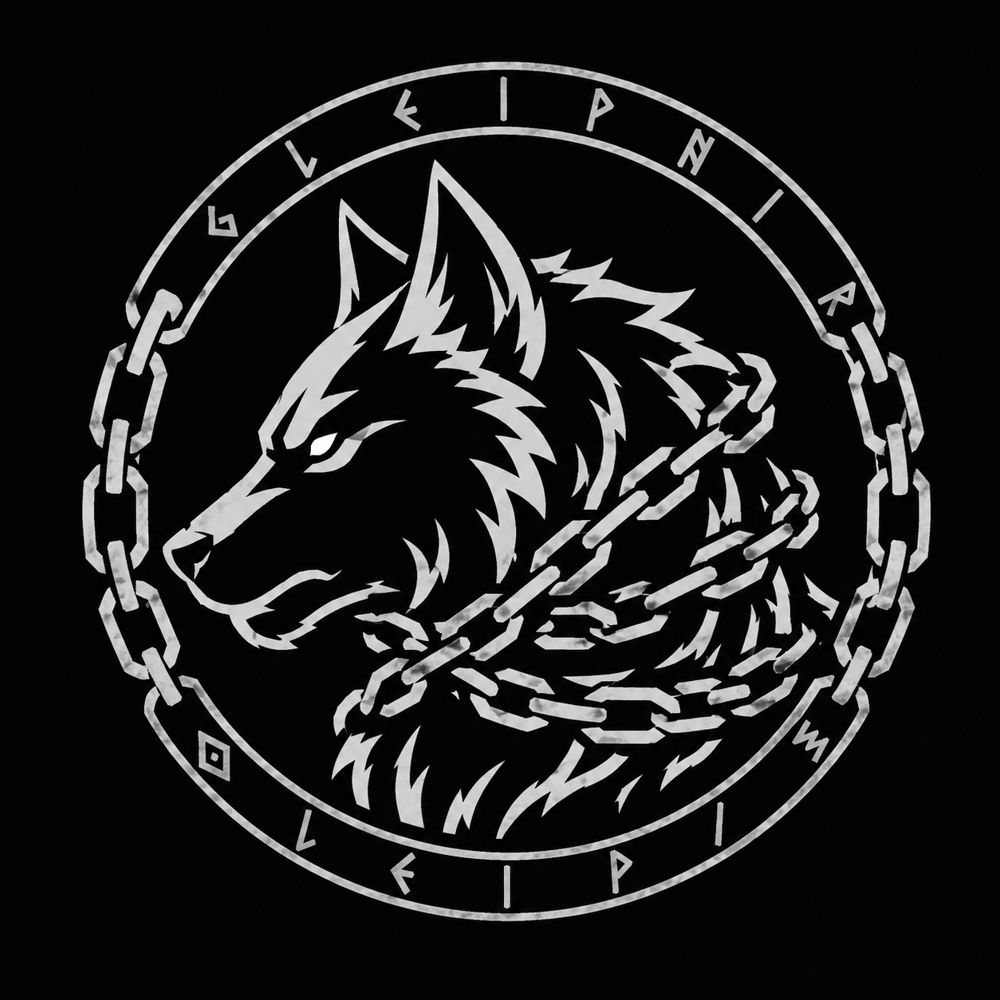

<p align="center">
  <h1>Gleipnir</h1>
</p>

<p align="center">
  
</p>

<p align="center">
  
  
  
  
</p>

<p align="center">
  <a href="README.md"><b>Read in English</b> &gt;</a>
</p>

Implementação de referência da **IPC (Immutable Provenance Chain)** — uma rede mínima e criptograficamente auditável para ancoragem de proveniência.

## Problema

**Saber não é o mesmo que demonstrar.** Uma equipa pode ter processos internos corretos, registos rigorosos e controlos apertados — e ainda assim falhar uma auditoria externa porque a evidência nunca foi desenhada para ser lida por alguém de fora. Os logs podem ser rotacionados, as bases de dados podem ser alteradas, os timestamps podem ser falsificados. Mesmo com as melhores intenções, *mostrar* que um determinado artefacto existiu num dado momento, intocado, exige um sistema cujo propósito principal é ser inspecionado.

Este é fundamentalmente um problema de **cadeia de custódia de decisões**, não um problema de logs. Um auditor a investigar um incidente precisa de saber: *quem decidiu promover aquela build? Qual foi a base da revisão? Podemos provar criptograficamente que a decisão registada é exatamente a decisão que produziu o artefacto que causou o incidente?* Os logs normais respondem "o que aconteceu quando" — mas não "quem decidiu, com base em quê, e podemos confiar nisso." O Gleipnir colmata essa lacuna com **accountability** (cada entrada ancorada está ligada a uma identidade de submissor) e **non-repudiation** (uma vez assinada e validada pelo quórum, nenhuma parte pode negar a submissão).

As soluções existentes são insuficientes:
- **Serviços de timestamp centralizados** são opacos — confiamos na palavra deles, não na prova.
- **Blockchains de uso geral** são excessivos — caros, lentos, dependentes de tokens e requerem configuração complexa para uma única tarefa: ancorar hashes.
- **Trilhos de auditoria artesanais** não são desenhados para revisão adversarial — a mesma equipa que gere o processo também controla a evidência.

## Solução

Uma rede leve de **quórum M-de-N Dilithium3** que ancora hashes numa cadeia imutável sem tokens, sem mineração, sem dependências externas. Cada ciclo produz um bloco ancorado assinado por um proponente selecionado por VRF e validado por um limiar configurável de validadores. É desenhado de raiz para produzir evidência de **quem decidiu o quê, quando, e com base em quê** — evidência que sobrevive a escrutínio adversarial porque foi construída para ser lida por alguém que não confia em si.

As **sub-chains** estendem o modelo: cada serviço tem a sua própria cadeia de proveniência ancorada numa SMT, com checkpoint periódico na cadeia principal através de provas cross-chain.

## O que oferece

- **Cadeia de hashes imutável** — cada hash ancorado é registado permanentemente numa cadeia linear e assinada de blocos
- **Assinaturas pós-quânticas** — quórum M-de-N Dilithium3, limiar configurável
- **KEM pós-quântico** — Kyber1024 para canais peer-to-peer encriptados
- **Eleição de líder ECVRF** — VRF Ristretto255 (RFC 9381), resistente a grinding, cada prova verificável
- **Consenso multi-nó** — seleção de proponente por ECVRF via gossip + verificação de raiz SMT + co-assinatura M-de-N
- **Sub-chains** — SMT por serviço + ancoragem periódica + provas cross-chain dual-Merkle
- **Finalidade instantânea** — um ciclo = um bloco = final; sem forks, sem rollbacks
- **Árvore Merkle Dispersa (SMT)** — raiz de estado compacta e verificável via Blake3 (profundidade configurável, padrão 256)
- **Rede auto-supervisionada** — difusão Laplaciana monitoriza a saúde da topologia a partir de latências de heartbeat
- **Zero token, zero mineração, zero smart contracts** — consenso puro para proveniência
- **Descoberta de pares e transporte real** — libp2p GossipSub + mDNS (ver `pkg/transport/p2p`)
- **Persistência** — estado em BoltDB com auto-persistência em `Stop()` e `RunCycle()` (ver `pkg/storage`)
- **Validação de cliente** — `ValidateEntry`, `IsZeroHash`, códigos de erro legíveis por máquina (ver `pkg/validation`)
- **Rate limiting limitado** — sliding-window por submissor com evicção LRU (ver `pkg/consensus/ratelimit.go`)
- **UID0 derivado de contrato** — identidade determinística ligada ao hash de um contrato empresarial (ver `pkg/identity/contract.go`)

## Narrativa de compliance

| Funcionalidade técnica | O que significa para um auditor |
|---|---|
| **Quórum M-de-N Dilithium3** | Nenhuma parte isolada pode forjar ou retroceder evidência — é necessária a conluio de M validadores. O limiar é configurável (ex.: 3/3 para alta segurança, 2/3 para flexibilidade operacional). |
| **Eleição de líder ECVRF** | Os proponentes de blocos são selecionados verifi cavelmente ao acaso — ninguém escolhe quem constrói o próximo bloco, portanto ninguém pode manipular a linha temporal. |
| **Finalidade instantânea** | Um ciclo = um bloco = final. Sem forks, sem rollbacks. Uma vez ancorado, um hash fica registado permanentemente — não há janela de "desfazer". |
| **Sparse Merkle Tree (SMT)** | Cada bloco compromete-se com uma raiz de estado verificável. Um cliente pode solicitar uma prova compacta de que um hash específico foi incluído — e qualquer terceiro pode verificar essa prova contra a cadeia pública. |
| **Sub-chains + provas cross-chain** | Cada serviço tem a sua própria cadeia isolada, com checkpoint periódico na cadeia principal. Um auditor vê evidência por serviço mais uma ligação criptográfica à linha temporal global. |
| **Identidade UID0 vinculada a contrato** | Cada nó validador está criptograficamente ligado ao hash de um contrato empresarial — o nó fala pela entidade legal, não por uma chave anónima. |
| **Ancoragem de decisões** | Cada entrada ancorada inclui a identidade do submissor e um rótulo legível por humanos. Um auditor pode rastrear um artefacto específico até à pessoa ou sistema que o submeteu, o momento da submissão e o bloco que o finalizou — estabelecendo uma cadeia de custódia criptograficamente verificável desde a decisão até à implementação. |
| **Auto-supervisão Laplaciana** | A rede monitoriza a sua própria saúde através de valores próprios de difusão. Um auditor pode verificar que a rede estava operacional nos momentos reclamados, não apenas que os blocos existem. |

## Como funciona

1. Cada par calcula uma **prova ECVRF** `sk.Prove(cycle || stateRoot)` usando a sua chave VRF Ristretto255 — as provas são disseminadas por gossip, verificadas contra a chave pública VRF de cada par, e o par com o Gamma mais baixo torna-se proponente
2. O proponente recolhe hashes pendentes via gossip, constrói um bloco, insere na SMT e transmite a proposta
3. Os pares não-proponentes inserem as mesmas entradas na sua SMT local, verificam se a raiz corresponde e co-assinam com **Dilithium3**
4. Com um **limiar M-de-N** de assinaturas, o bloco é finalizado e anexado à cadeia
5. Os operadores de serviço registam **sub-chains** (uma por serviço), submetem entradas e, periodicamente, **ancoram** a raiz de estado da sub-chain na cadeia principal
6. Cada validador dissemina o seu heartbeat; o valor próprio **Laplaciano λ₁** da matriz de latências supervisiona a difusão da rede

## Para quem

- **DevOps / CI/CD** — ancorar atestações de build e deployment
- **Compliance / auditoria** — cadeia de custódia de decisões com non-repudiation, não apenas logs à prova de adulteração
- **Investigadores** — proveniência reproduzível de experiências
- **Edge / embedded** — pegada mínima, sem inchaço de blockchain

## Início rápido

```bash
# Compilar
make build

# Iniciar uma rede local de 5 validadores
docker compose up -d

# Submeter um hash
provectl submit --hash <sha256> --label "meu-artefacto"

# Verificar
provectl verify --hash <sha256>
```

## Arquitetura

```
provectl → gRPC API → Consensus Engine → SMT State → Chain Storage
                 ↕                         ↕
           SubChainManager      Libp2p GossipSub + mDNS
           (SMT por serviço →   (descoberta de pares & transporte)
            ancoragem →
            cadeia principal)
                 ↕
           Transport (Kyber1024 KEM → ChaCha20-Poly1305 AEAD)
```

Consulte [docs/ARCHITECTURE.md](docs/ARCHITECTURE.md) para a descrição arquitetural completa, topologia de implantação e modelo de sub-chains.

## Estado atual

O `RunCycle()` suporta modos **single-node** (`NewEngine`) e **multi-node** (`NewEngineWithPeers` + `GossipChannel`). O caminho multi-node usa seleção de proponente ECVRF, constrói blocos via gossip, verifica replicação da raiz SMT e recolhe co-assinaturas M-de-N Dilithium3. As sub-chains (`SubChainManager`) permitem ancoragem por serviço com provas cross-chain. A camada de transporte (`pkg/transport`) fornece canais AEAD autenticados por KEM (Kyber1024 + ChaCha20-Poly1305).

**Issues #1–4 resolvidas** (I1–I4):
- **Eleição de líder ECVRF**: VRF Ristretto255 (RFC 9381) — cada par prova a seleção de proponente com uma prova criptográfica verificável e imprevisível; resistente a grinding
- **Quórum BFT M-de-N**: limiar configurável (1/1 single-node, 3/3 ou superior multi-node); ataque de assinatura duplicada rejeitado (cada signatário distinto contado uma vez)
- **Kyber1024 KEM**: usado em `pkg/transport/secure_conn.go` para canais peer-to-peer encriptados
- **Power iteration para λ₁**: power iteration shift-invert com fatorização de Cholesky; fallback para EigenSym denso em matrizes pequenas ou sem convergência

**Também completo** (G1–G6):
- **API gRPC**: pânico de inicialização protobuf resolvido; testes do servidor passam (`pkg/server`)
- **Transporte P2P**: libp2p GossipSub + descoberta mDNS (`pkg/transport/p2p`)
- **Persistência**: `EngineStorage` em BoltDB carrega automaticamente no init, guarda automaticamente em `Stop()` e `RunCycle()` (`pkg/storage`)
- **Validação de cliente**: `pkg/validation` exporta `ValidateEntry`, `IsZeroHash`, `ValidationError` com códigos
- **Rate limiting**: sliding-window por submissor com evicção LRU (sem fugas de memória) (`pkg/consensus/ratelimit.go`)
- **Profundidade SMT**: configurável via `state.Config.SMTDepth` (padrão 256), usado pelo engine e sub-chains

A API de submissão está robusta (`pkg/consensus/api.go`): `Enqueue` valida entradas e impõe rate limits, `RunCycle` recupera de panics, e `Engine.Stop` interrompe a ingestão de forma limpa. A identidade raiz UID0 pode ser derivada deterministicamente do hash de um contrato empresarial (`pkg/identity/contract.go`), fornecendo uma ligação verificável "nó fala pelo contrato X".

## Stack

| Componente | Tecnologia |
|---|---|
| Consenso | Eleição de líder ECVRF (Ristretto255, RFC 9381) + quórum M-de-N Dilithium3 |
| Estado | Sparse Merkle Tree (Blake3, profundidade configurável, padrão 256) |
| Transporte | Kyber1024 KEM + ChaCha20-Poly1305 AEAD (libp2p GossipSub + mDNS) |
| Sub-chains | SMT por serviço + provas cross-chain dual-Merkle |
| Rede | gRPC + Libp2p GossipSub |
| Supervisão | Difusão Laplaciana λ₁ |
| Persistência | BoltDB (embebido) |
| Rate limiting | Sliding window + evicção LRU |
| Linguagem | Go |
